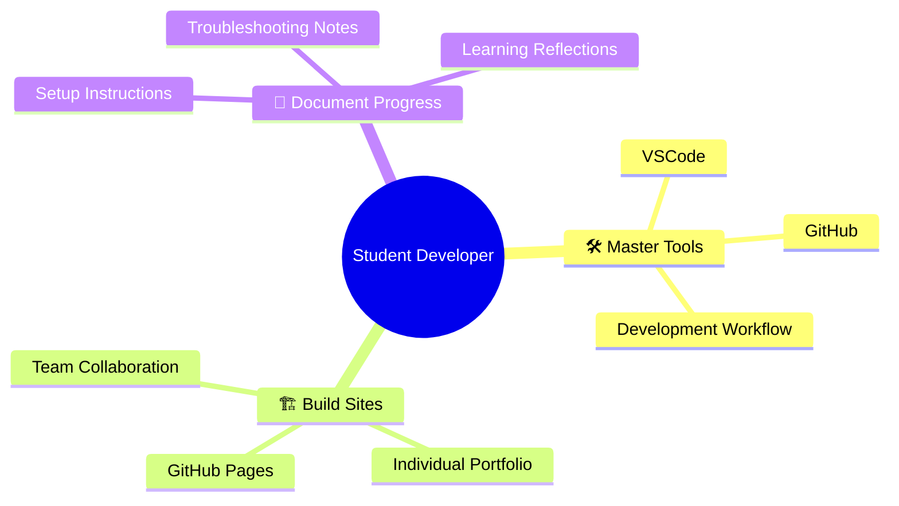
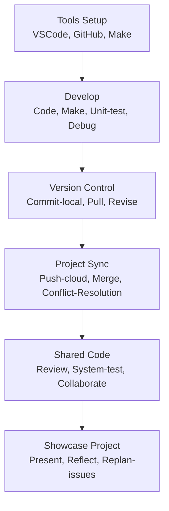
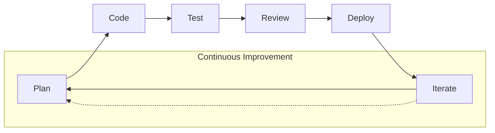
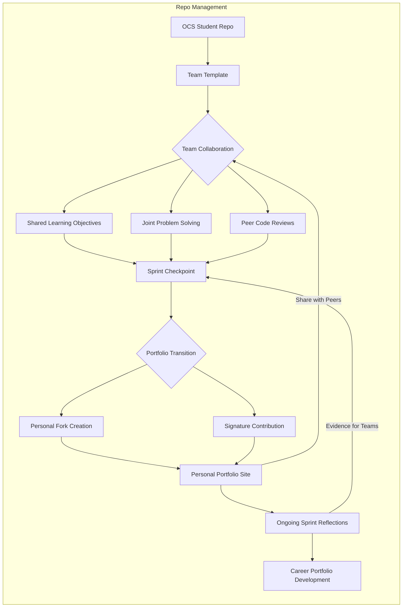
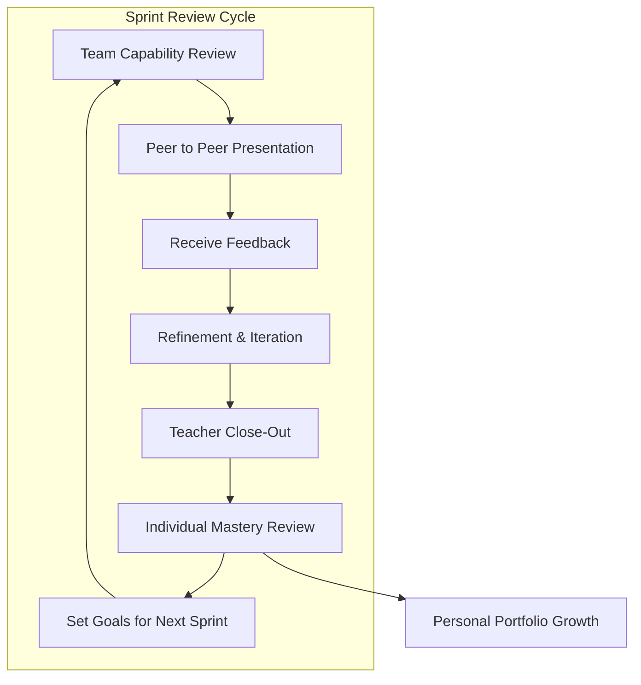

## Task-Centered Introduction - Onboarding Challenge

Welcome to the **Open Coding Society** — where you'll master professional development tools while building your first team project.

**Here's what makes this different:** Instead of just following instructions, you'll be actively documenting your setup process, troubleshooting problems, and creating solutions that help you and your teammates succeed.

**You are a student developer** learning essential professional skills:
- Master industry-standard development tools
- Build team and individual GitHub Pages sites
- Develop effective collaboration workflows
- Document your learning journey

This sprint mirrors real software engineering onboarding at technology companies.

### The Problem
New students often feel overwhelmed in their first weeks: new tools, unfamiliar workflows, and unclear expectations. Your job is to master these essentials while helping your team succeed.

### The Goal
By the end of this sprint, you will:
- **Build Sites**: Have your own team and individual GitHub Pages site online.
- **Master Tools**: Be proficient with essential development tools.
- **Document Progress**: Create clear documentation of your setup and learning process.

**Professional software developers** use these same tools and workflows when joining new teams and building applications.

### Why This Matters
The skills you master this sprint form the foundation for all your future coursework. Strong tool mastery means you can focus on coding concepts rather than fighting with your environment.

---

## Activation – Building on What You Already Know

> **Remember:** You are both a **learner** and a **documenter** in this sprint. Everything you experience as a new student — every success, every error, every breakthrough — becomes valuable documentation for yourself and others.

Before we dive into tools and code, let's tap into knowledge you already have. Even without programming experience, you've worked with concepts that will help you succeed.

### Familiar Learning Concepts
You've likely used:
- **Rubrics** – scoring guides that set clear expectations.  
- **Checklists** – step-by-step task trackers to ensure nothing gets missed.  
- **Assessments** – quizzes, reflections, or projects used to measure progress.

You may have also heard:
- **Action verbs (Bloom's)** – words that describe different levels of thinking.

  - **Remember** - Recall facts and basic concepts about tools and commands
  - **Understand** - Explain how tools work and their purpose in development workflow  
  - **Apply** - Perform basic setup, installation, and coding tasks
  - **Analyze** - Troubleshoot problems by examining logs, error messages, and system behavior
  - **Evaluate** - Assess and correct errors, compare solutions, and make correct tool choices; peer review others' work
  - **Create** - Produce original code, customize configurations, and add to projects

You are probably familiar with team words:
- **The 4C's** – skills that make teams stronger and projects more effective.
  - **Communication** - expressing what we are learning, both verbally and in writing.
  - **Collaboration** - working together on tasks and coordinating team efforts.
  - **Critical Thinking** - solving tough problems through cognition and systematic work.
  - **Creativity** - making useful solutions out of many unknowns.

### Your Learning Advantage

You've spent over a decade experiencing different learning environments. Through **25+ teachers**, countless assignments, and various challenges, you've developed intuition about what helps you learn effectively—and what doesn't.

**This experience helps you:**
- **Recognize when you're confused** → Document what clarifies concepts for you
- **Know how instructions should flow** → Create clear setup guides from your experience  
- **Understand helpful feedback** → Give constructive peer reviews
- **See when teams work well** → Contribute to effective collaboration
- **Identify your learning style** → Track what keeps you engaged vs. when you're lost

**As a student developer, you'll apply this by:**
- **Documenting with clarity** → Drawing on frustrations to write better instructions
- **Writing clear setup guides** → Using confusion points to create helpful documentation
- **Building effective team workflows** → Designing collaboration that actually works
- **Tracking your progress** → Showing your growth path through commits and reflections
- **Testing and improving** → Refining based on what works

#### Your Documentation Mission

Unlike experienced developers who must imagine the beginner experience, **you are the beginner**. Your authentic struggles with tools, concepts, and collaboration become **valuable documentation** for improving the onboarding process.

**Remember:** Every error you solve, every breakthrough you capture, and every clear instruction you write will directly help you review for assessments and help future students who follow your path.

---

## Demonstration – See the Tools and Workflow in Action

> *Note:* Everyone should follow along by opening your own VSCode editor and GitHub repo.

In this phase, the Teacher will walk you through the essential tools you’ll use to build and improve code; these are the results of the onboarding process:

- **VSCode** – The code editor where you’ll write your Markdown, JavaScript, and other files.  
- **VSCode Marketplace** – How to find and install useful extensions that make coding easier and more efficient.  
- **Make** – Using Makefiles to automate repetitive tasks like building and deploying your site.  
- **GitHub Commits** – How to save and document your changes in your code repository.  
- **GitHub Actions** – Automated workflows that build and publish your GitHub Pages site whenever you push updates.

### What You’ll See

- Opening VSCode and review the key extensions from the Marketplace. 
- A brief review of this Notebook and the Markdown used to create it.
- Make a change, saving a file, and generating a simple commit via VSCode.  
- Syncing the commit to GitHub and triggering a GitHub Action to publish your site.

These tools support the Software Development Lifecycle (SDLC) — the process of planning, creating, testing, and deploying software.

### Overview of Documentation Series

Once you’re comfortable with these tools, you’ll dive deeper into our documentation series, which includes:

- Agile Methodologies (picking teams is priority)  
- Framework for Sprints (week 1 is priority)  
- Tools & Equipment (running SDLC is priority)
- GitHub Pages (anatomy, layouts, breaking down a page)
- Onboarding Aventure (pick how you start)

---

### Ground 0 – Onboarding Challenge Checklist

**Goal for today:** Understand the mission, set up your space, and connect with your team.

**1. Understand the Task**
- [ ] I have read the **Sprint 1 – Onboarding Challenge** introduction.
- [ ] I can explain the mission in my own words.
- [ ] I understand how mastering tools helps my future learning.

**2. Know the Tools**
- [ ] I know the computer requirements and can communicate my personal hardware strategy.
- [ ] I can name the key tools we'll be using this sprint (even if I haven't installed them yet).
- [ ] I know where to find the setup instructions.

**3. Connect with the Team**
- [ ] I have read the team selection process and considered diversity instructions.
- [ ] I have joined Slack and understand how to communicate directly and in channels.
- [ ] I have met my teammates and shared with them how to contact me on Slack and by text, in case I am slow to respond.

**4. Apply Familiar Concepts**
- [ ] I know what a **rubric** is and how it will be used to evaluate my work.
- [ ] I understand what **checklists** are for and how to use them.
- [ ] I have read this **blog** and understand that I will be using it to **remember** and **understand** sprint requirements.
- [ ] I can recognize **Bloom's action verbs** and will use them to show evidence of progress in my work and blogs.
- [ ] I can name the **4C's** and think of one way I'll use them in my work this week.

**5. Prepare to Build**
- [ ] I have opened my GitHub account or confirmed access to it.
- [ ] I know where our GitHub Pages site lives.
- [ ] I'm ready to start building and documenting my progress.

#### Pre-Team Activity
- Read article on selecting teams.
- Start forming groups of 3 and teams of 6, sit in proximity.

#### Team Activity
- Team discussion using whiteboards and sticky notes.
- Fork and collaborate on a GitHub repo. Share repository, individuals fork or commit directly.
- Create collaborative and individual GitHub issues to track progress.
- Set up channel or group DM on Slack.
- Complete the checklist above and be ready for Ground 0 + 1 tools setup.
- Pick required coding challenges.
- Prepare to share progress at Sprint close.

## Application – Mastering Development Tools and Workflow

In this phase, you will apply your growing skills and knowledge by completing key objectives that demonstrate your mastery across technical, collaborative, and reflective domains.

### Establish Agile Processes

Process mastery leads to technical growth.

### Sprint 1 Key Objectives  
Complete all key objectives below and find the supporting hacks that demonstrate your level of mastery.

> **Hyperflex Reminder:** This isn't a rigid checklist! Adapt your approach based on what works for your learning style and team dynamics. The goal is growth, not perfection.

**What Goes in Notes/Evidence:**  
- **Technical Skills:** Links to working code, screenshots of setup processes, video demos  
- **Team Collaboration:** Joint commits, peer review screenshots, collaborative problem-solving documentation  
- **Learning Growth:** Before/after comparisons, error documentation with solutions, reflection blog posts  
- **AI Integration:** Prompt examples with your improvements, comparison of AI output vs. your final work  

**Ranking System:**  
- 0 = ❌ .00 - No evidence/faking progress  
- 1 = .55 - Imagine-Tinker-Remember (explore, prototype, revise)  
- 2 = .75 - Plan-Understand (explain concepts, create actions, form tasks)  
- 3 = .85 - Code-Apply (work on task, apply to dependencies)  
- 4 = .90 - Test-Analyze, Evaluate (assess, troubleshoot, debug, propose task revision)  
- 5 = +.01 per iteration - Review-Iterate (compare solution to requirements, adjust requirements, cycle to next task)  
- Mastered-Y = 🎨 .93 - Create (original work/customization)  

| Skill                                  | Mastered (Y/N) | Rank (0-5) | Mastery Score (Pct) | Notes/Evidence                                                                                   |
|----------------------------------------|----------------|------------|--------------------|-------------------------------------------------------------------------------------------------|
| Laptop Verification or Cloud Workspace | [ ]            | 0          | 0.0%               | Document setup process, troubleshooting steps, and system configurations                        |
| VSCode Setup & Usage                   | [ ]            | 0          | 0.0%               | Show iterative improvement from basic setup to advanced debugging workflows                     |
| VSCode Sharing and Collaboration       | [ ]            | 0          | 0.0%               | Demonstrate progression using VSCode Marketplace: LiveShare and GitLens                         |
| Student Repository Creation            | [ ]            | 0          | 0.0%               | Show evolution from template to personalized, well-organized repository with Actions running|
| Hacks: Tools & Equipment               | [ ]            | 0          | 0.0%               | [Link showing your learning journey, mistakes, and improvements]                                |
| Hacks: Portfolio and Blogging          | [ ]            | 0          | 0.0%               | [Link demonstrating iterative portfolio development and problem solving]                        |
| Hacks: Theme, Style, Layout            | [ ]            | 0          | 0.0%               | [Link showing progression to understanding and personalizing presentation]                      |
| Hacks: JavaScript Frontend Pick 2+     | [ ]            | 0          | 0.0%               | [Link documenting learning process, new understanding, and challenges encountered]              |
| AI Evidence in Work                    | [ ]            | 0          | 0.0%               | Document AI prompts, responses, and how you iterated/improved/customized beyond AI output       |
| Team Collaboration Evidence            | [ ]            | 0          | 0.0%               | Show live review, collaborative commits, peer reviews, joint problem-solving, and peer teaching |
| Learning Through Mistakes              | [ ]            | 0          | 0.0%               | Document failures, debugging process, rework and iterative improvement                          |
| **Total Points**                       |                | **0**      | **0.0%**           | Sum of Columns                                                                                  |
| **Mastery Score**                      |                | **0.0**    | **0.0%**           | Average of Columns                                                                             |

### Self Diagnostic and Summative Evaluation

> **Multi-Stage Evaluation Process:** This assessment uses multiple perspectives and timing to create a comprehensive learning profile.

#### Evaluation Timeline & Process

**🟢 START OF SPRINT – Diagnostic Phase:**  
- **Individual:** Take this as a baseline diagnostic and share with Teacher  
- **Purpose:** Establish starting point and learning goals  

**🟡 DURING SPRINT – Formative Phase:**  
- **Peer Review:** Engage in circular evaluation within trios for feedback  
- **Purpose:** Continuous improvement and collaborative learning  

**🔴 END OF SPRINT – Summative Phase:**  
- **Self-Assessment:** Complete assessment with reflective notes  
- **Teacher Evaluation:** Oral discussion with teacher on progress and growth  
- **Documentation:** Capture all evaluations in your blog as baseline for next project  

---

#### Agile-Based Ranking System

Scoring Guide:  
- 1 = .55 - Self-management (Taking ownership)  
- 2 = .75 - Incremental progression (Step-by-step growth)  
- 3 = .85 - Self-organization (Time & priority management)  
- 4 = .90 - Iterative techniques (Continuous refinement)  
- 5 = +.01 per quality delivery - Continuous delivery (Consistent contribution)  
- Mastered-Y = .93 - Excellence in all areas  

---

#### Evaluation Matrix

| Skill                    | Mastered (Y/N) | Self Rank (1-5) | Peer Rank (1-5) | Teacher Rank (1-5) | Average | Notes/Evidence |
|--------------------------|----------------|-----------------|-----------------|-------------------|---------|----------------|
| **Core Behaviors**    |                |                 |                 |                   |         |                |
| Attendance               | [ ]            | 0               | 0               | 0                 | 0.0     |                |
| Work Habits              | [ ]            | 0               | 0               | 0                 | 0.0     |                |
| Behavior                 | [ ]            | 0               | 0               | 0                 | 0.0     |                |
| Timeliness               | [ ]            | 0               | 0               | 0                 | 0.0     |                |
| **Technical Skills**  |                |                 |                 |                   |         |                |
| Tech/Cyber Sense         | [ ]            | 0               | 0               | 0                 | 0.0     |                |
| Tech/Cyber Talk          | [ ]            | 0               | 0               | 0                 | 0.0     |                |
| Tech Growth              | [ ]            | 0               | 0               | 0                 | 0.0     |                |
| **Collaboration**     |                |                 |                 |                   |         |                |
| Advocacy                 | [ ]            | 0               | 0               | 0                 | 0.0     |                |
| Communication & Collab   | [ ]            | 0               | 0               | 0                 | 0.0     |                |
| **Professional Skills**|                |                 |                 |                   |         |                |
| Integrity                | [ ]            | 0               | 0               | 0                 | 0.0     |                |
| Organization             | [ ]            | 0               | 0               | 0                 | 0.0     |                |
| **TOTALS**            |                | **0**           | **0**           | **0**             | **0.0** |                |
| **AVERAGE SCORE**     |                | **0.0**         | **0.0**         | **0.0**           | **0.0** |                |

### Weekly Cycle – “See → Do → Reflect”

Work with your team, but submit and produce individual evidence.  
Bring your progress into peer and checkpoint reviews.

1. **See** – Observe tool use in Demonstration or from teacher.  
2. **Do** – Apply skills through Hacks and project work.  
3. **Reflect** – Answer guiding questions and update your evidence.  

---

#### Team-to-Personal Transition Strategy

**Week 1-2: Team Foundation**
- [ ] Establish team manifest, coding standards and communication protocols
- [ ] Review _layouts, templates, and style guides  
- [ ] Practice live share, debugging, and pair programming sessions
- [ ] Start team decision-making processeses: stand-up, pin-up, burndown

**Week 3: Portfolio Preparation**
- [ ] Identify your **signature contributions** to team projects
- [ ] Create reflection documentation for each major feature
- [ ] Plan your **unique portfolio theme** and personal branding
- [ ] Document mistakes, lessons learned, and queues to guide your individual work

**Week 4: Portfolio Launch**  
- [ ] Fork team repository to personal, prepare to break off from fork
- [ ] Customize personal site with individual design choices, about page
- [ ] Create **"From Team to Individual"** reflection blog post
- [ ] Establish personal blogging plan for ongoing sprints

---

#### Checkpoint guide for reflective evidence

| Hack Objective               | Example Evidence                                                      | Reflection Question | Rank (0–5) |
|------------------------------|------------------------------------------------------------------------|---------------------|------------|
| **Tools & Equipment**        | Screenshots of VSCode setup, GitHub connection, Makefile running      | How did I learn or improve my tool workflow this week? |   |
| **Portfolio & Blogging**     | Blog posts showing challenges and solutions                           | How did I improve in LxD this week? |   |
| **Theme, Style, Layout**     | Before/after site design changes                                      | What design choices did I make, and why? |   |
| **JavaScript Frontend Basics** | Code snippets, commit history, working UI components                | How did I apply Markdown, HTML, or JavaScript to improve presentation or interactivity? |   |
| **AI Evidence in Work**      | Prompts and AI output with your improvements                          | Where did AI help, and where did I override or improve on AI response? |   |
| **Manifesto Evidence**       | Peer review logs, joint commits, screenshots of collaborative coding  | How did working with others impact my approach or give me insight into better LxD? |   |
| **Learning Through Mistakes** | Bug logs, fix notes, before/after comparisons                         | What mistake taught me the most this week? |   |

## Integration – From Team Template to Personal Repository

In this phase, you'll take everything from **Onboarding Project** and fully integrate it into your personal work. Here is a summary of steps you should consider for repository management during the entirety of the sprint.

---

### Real-World Connection

This project mirrors **industry software development**:
- **Team repositories** = Enterprise codebases where multiple developers collaborate
- **Personal Repos** = Individual contributor and portfolio updates
- **Pull requests** = Code review and integration processes used by companies like Google, Microsoft, and Meta

### Repository Process Overview

1. **Start with the Open Coding Society (OCS) Student Repository**  
   - The **Student Repo** is the starter repository for GitHub Pages framework & guides.

2. **Fork to Your Team Repository**  
   - Individuals work on your own repo and create PRs to others.
   - Groups of 3 work together on a branch within the fork.
   - Teams of 6 coordinate together and manage main and PRs amongst teams.
   - Teams **pull updates** from the OCS repo if changes are made.  
   - Aim to submit **at least one Pull Request (PR)** to the OCS repo to improve it for future students.

3. **Build & Evolve as a Team**  
   - Develop features, complete hacks, and document progress.  
   - Share commits, review each other's work, and solve problems collaboratively.

4. **Create Your Personal Repository**  
   - During the sprint, **clone your team's repo** as update for your **personal repo**.  
   - This becomes your **personal blog & portfolio** for the rest of your coursework.

5. **Ongoing Use & Reflection**  
   - After every sprint, update your blog with **reflective evidence** from checkpoints.  
   - This personal repo will grow with your skills over the entire program.

---

### Build a Development Workflow

---

### Review – “Becoming proficient at the Software Development Life Cycle (SDLC)”

At the end of the sprint, teams consolidate their growth and show how they’ve applied **technical, collaborative, and design skills**.

---

#### Exit Process 

1. **Team Capability Review**
   - As a team, revisit your **objective checklist**.
   - Document how skills have been learned, applied, and integrated.
   - Focus on personal contributions and team growth.

2. **Peer ot Peer Presentation**
   - Present your **“How I’ve learned the SDLC”** summary to a peer team of six (two teams together).
   - Receive constructive peer feedback.
   - Identify areas for refinement.

3. **Refinement**
   - Update presentation & checklist based on peer feedback.
   - Strengthen evidence with clearer examples and stronger skill links.

4. **Teacher Sprint Close-Out Presentation**
   - Deliver refined presentation to Teacher during close-out.
   - Discuss integration of skills and capability development.

5. **Individual Mastery Reviews**
   - Meet individually with Teacher for mastery review.
   - Set personal focus goals for the **next sprint** based on feedback.

6. **Carry Improvements Forward**
   - Individual to maintain Personal Portfolio
   - Anticipate that next Sprint will include student led Teaching.

---

#### Exit Visual

---

## Sprint 1 Traditional Outline
Sprint 1 has had many revisions and has challenged learners over the years.  This is provided for reference, primarily for teachers.  The Task-centered approach and becoming proficient in the SDLC is new, the former experience was more a "CompSci tools for the sake of CompSci tools" approach.

[Sprint 1 Traditional]({{site.baseurl}}/sprint-1-traditional-objectives)
