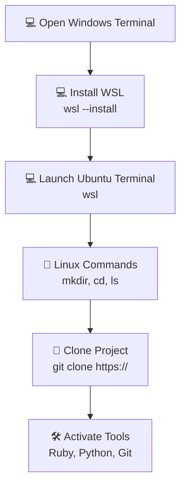

---

toc: True
layout: post
data: tools
title: Windows (WSL) Operating System and Tools Setup
description: Setup guide for using Windows Subsystem for Linux with Ubuntu for development.
categories: ['DevOps']
author: Lily Wu
permalink: /tools/os/windows
breadcrumb: True 
---

## Installation Hack

Welcome to your journey of setting up your Operating System and Tools! This setup process will guide you through working in a Linux terminal, managing folders, cloning a project, and adding packages.

## Visual Representation of the Workflow



## Shell Commands

- Windows: `wsl`, then standard Linux commands inside Ubuntu

## Version Control Commands

- **git clone**: Make a working copy of a git repository from the cloud to your local machine.
- **git pull**: Update your local copy of the repository with changes from the cloud repository.
- **git commit**: Save changes to files in your local repository.
- **git push**: Send updates from your local repository to the remote repository.

## Package Manager Commands – Ubuntu (apt)

- **Update package list:** `sudo apt update`
- **Upgrade installed packages:** `sudo apt upgrade`
- **Install a package:** `sudo apt install <package_name>`
- **Remove a package:** `sudo apt remove <package_name>`
- **Search for a package:** `apt search <package_name>`
- **List installed packages:** `apt list --installed`

---

## Windows Setup

### Install VSCode

[VSCode link, Select OS and select default on prompts](https://code.visualstudio.com/download)

### Install Git Config Manager (GCM)

[Git Config Manager and select default on prompts](https://git-scm.com/downloads/win)

### WSL common commands

- `wsl --help`, `wsl -l -o`, `wsl -l -v`, `wsl --shutdown`, `wsl --uregister`

### WSL install

1. Open Windows Terminal and Pin to Taskbar. All of these commands are activated from Windows Shell (`C:\`)

   ```bash
   wsl --install -d Ubuntu-24.04
   ```

2. Setup a username and password when prompted. On password you will be typing but will not see respones.

3. At the conclusion of the install you will receive a WSL Ubuntu prompt.  For now we will exit WSL.

   ```bash
   exit
   ```

4. Set as default:  

   ```bash
   wsl --set-default Ubuntu-24.04
   ```

5. To start WSL Ubuntu from (`C:\`)

   ```bash
   wsl
   ```

6. Close Terminal.

---

## WSL Ubuntu Setup

### First-time Setup

Open Terminal by right clicking on Terminal in Taskbar and selecting Ubuntu 24.04

Run these commands to set up your Ubuntu developer tools for the first time.

```bash
mkdir opencs
cd opencs
git config --global credential.helper "/mnt/c/Program\ Files/Git/mingw64/bin/git-credential-manager.exe"
git clone https://github.com/Open-Coding-Society/student.git
cd student/
./scripts/activate_ubuntu.sh # prompts for your recently created WSL Ubuntu password
./scripts/activate.sh # prompts for Git UID and Personal Email
./scripts/venv.sh
```

#### System Checks (Optional)

Open Terminal by right clicking on Terminal in Taskbar and selecting Ubuntu 24.04

Run these commands to verify your system setup and check installed tools.

```bash
python --version
pip --version
ruby -v
bundle -v
gem --version
git config --global --list
```

#### Restarting a terminal

Open Terminal by right clicking on Terminal in Taskbar and selecting Ubuntu 24.04

Each time you open a new terminal session, run these commands to activate your environment and start working on the student project in VS Code.

```bash
cd opencs/student
source venv/bin/activate
code .
```

---

## 💻 Interactive Terminal Practice

Now that you’ve learned about Windows tools and file systems, try using a simulated terminal.

This is a safe environment where you can practice basic commands.

### 🧠 Try these commands:

* `ls` → list files/folders
* `cd <folder>` → move into a folder
* `cd ..` → go back
* `mkdir <folder>` → create a folder
* `touch <file>` → create a file
* `cat <file>` → view file contents
* `git clone <url>` → mock clone a repo
* `clear` → clear terminal output
* `pwd` → show current path
* `help` → show commands

---

### ▶️ Terminal:

<div id="terminal" style="background:#111; color:#00ff90; padding:12px; font-family:monospace; border-radius:8px; height:250px; overflow-y:auto;">
  <p>> Welcome! Type <b>help</b> to begin.</p>
</div>

<input id="commandInput" placeholder="Enter command..." style="width:100%; padding:8px; margin-top:8px; font-family:monospace;" />

<script>
let path = ["home"];

const fileSystem = {
  "/home": {
    type: "dir",
    children: {
      documents: {
        type: "dir",
        children: {
          "notes.txt": { type: "file", content: "Remember to run ./scripts/activate.sh" }
        }
      },
      downloads: {
        type: "dir",
        children: {
          "image.png": { type: "file", content: "<binary file>" }
        }
      }
    }
  }
};

function currentPathString() {
  return "/" + path.join("/");
}

function getCurrentNode() {
  let node = fileSystem["/home"];
  for (let i = 1; i < path.length; i++) {
    node = node.children[path[i]];
    if (!node || node.type !== "dir") {
      return null;
    }
  }
  return node;
}

function listCurrentDir() {
  const node = getCurrentNode();
  if (!node) return [];
  return Object.keys(node.children);
}

function createDirectory(name) {
  const node = getCurrentNode();
  if (!node || !name) return "Usage: mkdir <folder>";
  if (node.children[name]) return `mkdir: cannot create directory '${name}': File exists`;
  node.children[name] = { type: "dir", children: {} };
  return null;
}

function createFile(name, content = "") {
  const node = getCurrentNode();
  if (!node || !name) return "Usage: touch <file>";
  if (!node.children[name]) {
    node.children[name] = { type: "file", content };
  }
  return null;
}

function mockClone(url) {
  if (!url) return "Usage: git clone <url>";
  const repoPart = url.split("/").pop() || "repository";
  const repoName = repoPart.replace(/\.git$/, "") || "repository";
  const node = getCurrentNode();
  if (!node || node.children[repoName]) {
    return `fatal: destination path '${repoName}' already exists and is not an empty directory.`;
  }
  node.children[repoName] = {
    type: "dir",
    children: {
      README: { type: "file", content: `# ${repoName}\nMock repository created in simulator.` },
      scripts: {
        type: "dir",
        children: {
          "activate.sh": { type: "file", content: "echo Activating environment..." }
        }
      }
    }
  };
  return `Cloning into '${repoName}'...\nremote: Simulated clone complete.`;
}

function print(text) {
  const terminal = document.getElementById("terminal");
  terminal.innerHTML += `<p>${text}</p>`;
  terminal.scrollTop = terminal.scrollHeight;
}

document.getElementById("commandInput").addEventListener("keydown", function(e) {
  if (e.key === "Enter") {
    const input = e.target.value.trim();
    print(`> ${input}`);

    if (input === "help") {
      print("Commands: ls, cd <folder>, cd .., mkdir <folder>, touch <file>, cat <file>, git clone <url>, clear, pwd, help");
    }

    else if (input === "ls") {
      const entries = listCurrentDir();
      print(entries.length ? entries.join("  ") : "Empty");
    }

    else if (input.startsWith("cd ")) {
      const dir = input.split(" ")[1];

      if (dir === "..") {
        if (path.length > 1) path.pop();
      }
      else {
        const node = getCurrentNode();
        if (node?.children[dir]?.type === "dir") {
        path.push(dir);
        } else {
          print("Directory not found");
        }
      }
    }

    else if (input.startsWith("mkdir ")) {
      const dirName = input.split(" ").slice(1).join(" ").trim();
      const error = createDirectory(dirName);
      if (error) print(error);
    }

    else if (input.startsWith("touch ")) {
      const fileName = input.split(" ").slice(1).join(" ").trim();
      const error = createFile(fileName);
      if (error) print(error);
    }

    else if (input.startsWith("cat ")) {
      const fileName = input.split(" ").slice(1).join(" ").trim();
      const node = getCurrentNode();
      const target = node?.children[fileName];
      if (target?.type === "file") {
        print(target.content || "");
      } else {
        print(`cat: ${fileName}: No such file`);
      }
    }

    else if (input.startsWith("git clone ")) {
      const url = input.split(" ").slice(2).join(" ").trim();
      print(mockClone(url));
    }

    else if (input === "clear") {
      const terminal = document.getElementById("terminal");
      terminal.innerHTML = "";
    }

    else if (input === "pwd") {
      print(currentPathString());
    }

    else {
      print("Unknown command (type 'help')");
    }

    e.target.value = "";
  }
});
</script>

---
