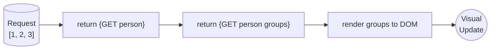

## Single Responsibility Principle (SRP) & API Chaining

This notebook explores three critical concepts in modern software development:
1. **Single Responsibility Principle (SRP)** - Each function/module should do ONE thing well
2. **API Chaining** - Sequential API calls where each step depends on the previous
3. **Function Anatomy** - Designing functions according to APCSP Procedural Abstraction requirements

### Why This Matters

- **Maintainability**: Code that follows SRP is easier to debug and modify
- **Testability**: Functions with single responsibilities are easier to test
- **Reusability**: Well-designed functions can be reused across different contexts
- **Collaboration**: Clear function purposes make team development smoother

## Part 1: Single Responsibility Principle (SRP)

### What is SRP?

The Single Responsibility Principle states that **a function or class should have one, and only one, reason to change**. In practice, this means each function should do exactly ONE thing.

### ❌ Bad Example: Multiple Responsibilities

```js
// This function does TOO MANY things!
function processUserData(userId) {
    // Responsibility 1: Fetch data from API
    const response = fetch(`/api/user/${userId}`);
    const userData = response.json();
    
    // Responsibility 2: Validate data
    if (!userData.email || !userData.name) {
        throw new Error('Invalid data');
    }
    
    // Responsibility 3: Transform data
    const displayName = userData.name.toUpperCase();
    
    // Responsibility 4: Update UI
    document.getElementById('userName').textContent = displayName;
    
    // Responsibility 5: Log analytics
    console.log('User viewed:', userId);
    
    return userData;
}
```

**Problems:**
- Hard to test (mixes API calls, validation, UI updates)
- Can't reuse validation logic elsewhere
- Changes to UI require modifying a function that also handles API calls
- Violates separation of concerns

### ✅ Good Example: Single Responsibilities

Breaking the previous function into focused, single-purpose functions:

```js
// Responsibility 1: Fetch data from API
async function fetchUserById(userId) {
    const response = await fetch(`/api/user/${userId}`);
    if (!response.ok) throw new Error(`Failed to fetch user ${userId}`);
    return response.json();
}

// Responsibility 2: Validate user data
function validateUserData(userData) {
    if (!userData.email || !userData.name) {
        throw new Error('User data missing required fields');
    }
    return true;
}

// Responsibility 3: Transform data for display
function formatDisplayName(name) {
    return name.toUpperCase();
}

// Responsibility 4: Update UI element
function updateUserNameDisplay(displayName) {
    const element = document.getElementById('userName');
    if (element) element.textContent = displayName;
}

// Responsibility 5: Log analytics event
function logUserView(userId) {
    console.log('User viewed:', userId);
}

// Sequence Orchestrator function (coordinates the workflow)
async function displayUserProfile(userId) {
    const userData = await fetchUserById(userId);
    validateUserData(userData);
    const displayName = formatDisplayName(userData.name);
    updateUserNameDisplay(displayName);
    logUserView(userId);
    return userData;
}
```

**Benefits:**
- ✅ Each function has ONE clear purpose
- ✅ Easy to test individually (`formatDisplayName` doesn't need API or DOM)
- ✅ Reusable (can use `validateUserData` in other contexts)
- ✅ Easy to modify (change UI without touching API logic)
- ❌ **Poor error handling** - What if `fetchUserById` fails? What if `validateUserData` throws? The UI will break with no feedback to the user!

**This leads us to API Chaining...** where we can add centralized error handling with `.catch()`!


## Part 2: API Chaining Pattern

### What is API Chaining?

API chaining is a pattern where **each API call depends on data from the previous call**. This creates a sequential workflow where Step 2 cannot execute until Step 1 completes.

### Real-World Example: User → Groups

**Scenario:** To display a user's groups, we need:
1. **Step 1:** Fetch user identity (to get `personId`)
2. **Step 2:** Use that `personId` to fetch groups
3. **Step 3:** Render the groups in the UI

**Why Chaining?** The groups API endpoint requires `personId`, which we don't have until Step 1 completes.

### The Chain Structure

```
Step 1: GET /api/person/get
   ↓
   Returns: { id: 123, uid: "student1", name: "Alice" }
   ↓
Step 2: GET /api/groups/person/123  (using id from Step 1)
   ↓
   Returns: [{ id: 5, name: "CS Team", members: [...] }]
   ↓
Step 3: Render groups to DOM
```



## Annotated API Chaining Code

Below is the complete chained pattern with detailed annotations explaining each step:

```javascript
/**
 * CHAINED API PATTERN: User Identity → User Groups → UI Rendering
 * 
 * Pattern: fetch().then().then().then().catch()
 * Each .then() represents a sequential step that depends on the previous
 */

// Global for chain
let currentPersonId;

// Global ERROR HANDLERS for chain
const ERROR_HANDLERS = {
    'AUTHENTICATION_REQUIRED': {
        message: 'Please sign in.',
        color: 'text-gray-400'
    },
    'INVALID_USER_DATA': {
        message: 'Unable to verify identity.',
        color: 'text-yellow-400'
    },
    'HTTP_ERROR': {
        message: (statusCode) => `Server error (${statusCode}).`,
        color: 'text-red-400'
    },
    'DEFAULT': {
        message: 'Error loading groups.',
        color: 'text-red-400'
    }
};

// STEP 0: Fetch User Identity to start the Chain
fetch(`${javaURI}/api/person/get`, fetchOptions)
    // STEP 1: Handle Errors and then returns JSON from response
    .then(response => {
        // SRP Focus: Handle authentication/response validation
        
        // Authentication check - throw specific error for auth failure
        if (response.status === 401) {
            throw new Error('AUTHENTICATION_REQUIRED');
        }
        
        // Error handling - throw specific HTTP error
        if (!response.ok) {
            throw new Error(`HTTP_ERROR_${response.status}`);
        }
        
        // Parse JSON and pass to next step
        return response.json();
    })
    
    // STEP 2: Handle errors and then returns a fetch of User Data & Groups
    .then(personData => {
        // SRP Focus: Validate user data and prepare next request
        
        // Data validation - throw specific error if user data missing
        if (!personData || !personData.id || !personData.uid) {
            throw new Error('INVALID_USER_DATA');
        }
        
        // Cache user identity for later use (join/leave operations)
        currentPersonId = personData.id;
        currentUid = personData.uid;

        // CHAIN DEPENDENCY: This request REQUIRES currentPersonId
d       return fetch(`${javaURI}/api/groups/person/${currentPersonId}`, fetchOptions);
    })
    
    // STEP 3: Handles group response
    .then(groupResp => {
        // SRP Focus: Handle group response, including fallback logic
        
        // Success path
        if (groupResp.ok) {
            return groupResp.json();
        } 
        
        // Fallback: If endpoint unavailable, fetch all groups and filter client-side
        else if (groupResp.status === 404) {
            console.warn('Using fallback: fetching all groups');
            return fetch(`${javaURI}/api/groups`, fetchOptions)
                .then(fallbackResp => {
                    if (!fallbackResp.ok) return [];
                    return fallbackResp.json().then(allGroups => {
                        // Client-side filtering (less efficient but works)
                        return (Array.isArray(allGroups) ? allGroups : [])
                            .filter(group =>
                                Array.isArray(group.members) && 
                                group.members.some(m => m.uid === currentUid)
                            );
                    });
                });
        }
        
        throw new Error('Failed to fetch group data');
    })
    
    // STEP 4: Renders Groups to UI
    .then(userGroups => {
        // SRP Focus: Transform data and update DOM
        
        const groups = Array.isArray(userGroups) ? userGroups : [];

        // Build lookup set for search feature
        groups.forEach(group => userGroupIds.add(group.id));

        // Render groups
        if (groups.length > 0) {
            // Map each group to HTML card with nested sorted map for member list
            springGroupInfo.innerHTML = groups.map(group => `
                <div>
                    <label class="block text-sm font-medium">Group Name</label>
                    <input type="text" readonly value="${group.name}"
                        class="w-full px-4 py-2 rounded-lg bg-neutral-700">
                </div>
                <div>
                    <label class="block text-sm font-medium">Period</label>
                    <input type="text" readonly value="${group.period}"
                        class="w-full px-4 py-2 rounded-lg bg-neutral-700">
                </div>
                <div class="col-span-2">
                    <label class="block text-sm font-medium">Members</label>
                    <div class="w-full px-4 py-2 rounded-lg bg-neutral-700">
                        ${[...group.members].sort((a, b) => a.name.localeCompare(b.name)).map(m => `${m.name} (${m.uid})`).join(', ')}
                    </div>
                </div>
                <div class="col-span-2">
                    <button type="button" 
                        onclick="leaveGroup('${group.id}', ${currentPersonId})"
                        class="px-4 py-2 bg-red-400 rounded-lg hover:bg-red-600">
                        Leave Group
                    </button>
                </div>
            `).join('');
        // Empty groups
        } else {
            springGroupInfo.innerHTML = `<p class="text-gray-400">No groups found.</p>`;
        }

        // Enable search (uses global currentPersonId)
        setupGroupSearch(groupSearchInput, groupResultsList, 
            joinGroupStatus, userGroupIds, currentPersonId);
    })
    
    // CATCH: Handles ANY error in the entire chain
    .catch(error => {
        // SRP Focus: Centralized error handling using ERROR HANDLERS data structure
        console.error("Error in API chain:", error);
        
        // Get handler and message from configuration
        let handler, displayMessage;
        
        if (error.message.startsWith('HTTP_ERROR_')) {
            handler = ERROR_HANDLERS['HTTP_ERROR'];
            const statusCode = error.message.replace('HTTP_ERROR_', '');
            displayMessage = handler.message(statusCode);
        } else {
            handler = ERROR_HANDLERS[error.message] || ERROR_HANDLERS['DEFAULT'];
            displayMessage = handler.message;
        }
        
        // Apply error message with appropriate styling
        springGroupInfo.innerHTML = `<p class="${handler.color}">${displayMessage}</p>`;
        groupSearchInput.disabled = true;
    });
```

### Key Observations
This illustrates a key design pattern.  The chain serves as an orchestration to prepare the output of groups for the logged in user.

#### Preparation
1. **Global Scope:** `currentPersonId` used in multiple chains
2. **Error Configuration:** `ERROR_HANDLERS` data structure anticipates error definitions from error handling logic from the start

#### Chain
1. **Sequential Dependencies:** Each `.then()` depends on data from previous steps
2. **Single Responsibilities:** Each `.then()` has ONE SRP focus:
   - **Validate** (authentication and parse response)
   - **Fetch** (validate data and initiate next request)
   - **Handle response** (process response and fallback logic)
3. **Last Responsibility:** Final `.then()` has terminal SRP focus:
   - **Render** (transform data and update UI - final stop in chain)
4. **Centralized Error Handling:** One `.catch()` handles all errors using the configuration object

**Error Handling Benefits:**
- ✅ **Debugging:** Error messages show exactly what went wrong
- ✅ **User Feedback:** Can display specific messages (authentication vs server errors)
- ✅ **No Silent Failures:** Prevents `null` from propagating through chain
- ✅ **Error Tracking:** Can log different error types to analytics

#### Mini chain
Inside of this larger chain there is a mini-chain in the Last Responsibility. There is a functional programming chaining example that prepares group members for each group.

Copy → Sorted array → Mapped strings → Join

```js
${[...group.members].sort((a, b) => a.name.localeCompare(b.name)).map(m => `${m.name} (${m.uid})`).join(', ')}
```


## Part 3: APCSP Function Anatomy (Procedural Abstraction)

### APCSP Requirements for Functions

According to APCSP Performance Task Requirements, a good procedure (function) must demonstrate:

1. **Parameters** - Input values that customize function behavior
2. **Algorithm** - Sequenced instructions implementing the function's purpose
3. **Return Value** - Output that can be used by calling code
4. **Abstraction** - Hides complexity, provides clear interface

### Example: Following SRP + APCSP Requirements

Let's design a function that validates group membership and follows both SRP and APCSP standards.


```javascript
%%js

/**
 * APCSP Procedural Abstraction Example
 * Function: isUserInGroup
 * 
 * Purpose: Determine if a specific user is a member of a given group
 * 
 * PARAMETERS (inputs that customize behavior):
 * @param {number} uid - The user's unique identifier (user ID)
 * @param {object} group - The group object containing members array
 * 
 * RETURN VALUE (output for calling code):
 * @returns {boolean} - true if user is in group, false otherwise
 * 
 * ALGORITHM (sequenced steps):
 * 1. Validate inputs exist
 * 2. Check if group has members array
 * 3. Search members array for matching uid
 * 4. Return boolean result
 * 
 * ABSTRACTION:
 * - Hides complexity of null checking and array iteration
 * - Provides simple yes/no answer
 * - Reusable across different contexts
 */
function isUserInGroup(uid, group) {
    // Step 1: Input validation (defensive programming)
    if (!uid || !group) {
        return false; // Invalid inputs = not in group
    }
    
    // Step 2: Ensure members array exists
    if (!Array.isArray(group.members)) {
        return false; // No members array = user can't be member
    }
    
    // Step 3: Search for user in members
    // Algorithm: Use .some() to check if ANY member matches uid
    const isMember = group.members.some(member => member.uid === uid);
    
    // Step 4: Return boolean result
    return isMember;
}

// USAGE EXAMPLES:

// Example 1: User is in group
const group1 = {
    id: 1,
    name: "CS Team",
    members: [
        { uid: 1, name: "Alice" },
        { uid: 2, name: "Bob" }
    ]
};

console.log(isUserInGroup(1, group1)); // true
console.log(isUserInGroup(3, group1)); // false

// Example 2: Invalid inputs (demonstrates abstraction)
console.log(isUserInGroup(null, group1));      // false (handles null gracefully)
console.log(isUserInGroup(1, null));  // false (handles null gracefully)
console.log(isUserInGroup(1, {}));    // false (handles missing members)
```

### Breaking Down the Function (APCSP Analysis)

#### 1. Parameters (Customization)
```javascript
function isUserInGroup(uid, group)
```
- **uid**: Changes WHO we're searching for
- **group**: Changes WHERE we're searching
- Different combinations of inputs produce different outputs

#### 2. Algorithm (Sequenced Steps)
```javascript
// Step 1: Validate inputs
if (!uid || !group) return false;

// Step 2: Check members array exists  
if (!Array.isArray(group.members)) return false;

// Step 3: Search array for matching uid
const isMember = group.members.some(member => member.uid === uid);

// Step 4: Return result
return isMember;
```

#### 3. Return Value (Output)
- Returns `boolean` (true/false)
- Calling code can use result in conditionals:
  ```javascript
  if (isUserInGroup(currentUid, group)) {
      console.log("Already a member!");
  }
  ```

#### 4. Abstraction (Hiding Complexity)
- **Hides:** Null checking, array validation, iteration logic
- **Provides:** Simple yes/no answer
- **Benefit:** Calling code doesn't need to know HOW the search works

### Why This Follows SRP

**Single Responsibility:** This function does ONE thing - checks membership.

It does NOT:
- ❌ Fetch data from API
- ❌ Update the UI
- ❌ Send analytics events
- ❌ Modify the group

**Result:** Easy to test, reuse, and maintain!

**Observation** Look at each of the console.log statements.  They each test variations of failure.  But, unlike former chaining example they do not return information regarding error type.

## Part 4: Refactoring the Chain with SRP

Let's refactor the chained API example into smaller SRP-compliant functions:


```python
/**
 * SRP-Compliant Functions for Group Management
 * Each function has exactly ONE responsibility
 */

// ============================================
// ERROR CONFIGURATION: Centralized error definitions
// ============================================
const ERROR_TYPES = {
    AUTHENTICATION_REQUIRED: 'AUTHENTICATION_REQUIRED',
    INVALID_USER_DATA: 'INVALID_USER_DATA',
    HTTP_ERROR: 'HTTP_ERROR',
    GROUPS_FETCH_FAILED: 'GROUPS_FETCH_FAILED'
};

const ERROR_MESSAGES = {
    [ERROR_TYPES.AUTHENTICATION_REQUIRED]: 'Please sign in to view groups.',
    [ERROR_TYPES.INVALID_USER_DATA]: 'Unable to verify your identity.',
    [ERROR_TYPES.HTTP_ERROR]: (statusCode) => `Server error (${statusCode}). Please try again.`,
    [ERROR_TYPES.GROUPS_FETCH_FAILED]: 'Failed to load groups. Please try again.',
    DEFAULT: 'An unexpected error occurred.'
};

// ============================================
// RESPONSIBILITY: Fetch user identity from API
// ============================================
async function fetchCurrentUser(javaURI, fetchOptions) {
    const response = await fetch(`${javaURI}/api/person/get`, fetchOptions);
    
    if (response.status === 401) {
        throw new Error(ERROR_TYPES.AUTHENTICATION_REQUIRED);
    }
    
    if (!response.ok) {
        throw new Error(`${ERROR_TYPES.HTTP_ERROR}_${response.status}`);
    }
    
    return response.json();
}

// ============================================
// RESPONSIBILITY: Validate user data structure
// ============================================
function validateUserIdentity(personData) {
    if (!personData || !personData.id || !personData.uid) {
        throw new Error(ERROR_TYPES.INVALID_USER_DATA);
    }
    return {
        personId: personData.id,
        uid: personData.uid,
        name: personData.name
    };
}

// ============================================
// RESPONSIBILITY: Fetch groups for a specific user
// ============================================
async function fetchUserGroups(personId, javaURI, fetchOptions) {
    const response = await fetch(
        `${javaURI}/api/groups/person/${personId}`, 
        fetchOptions
    );
    
    if (response.ok) {
        return response.json();
    }
    
    if (response.status === 404) {
        // Endpoint not available - return empty array (not an error)
        console.warn('Groups endpoint not found');
        return [];
    }
    
    throw new Error(ERROR_TYPES.GROUPS_FETCH_FAILED);
}

// ============================================
// RESPONSIBILITY: Filter groups by user membership
// ============================================
function filterGroupsByMembership(groups, uid) {
    if (!Array.isArray(groups)) return [];
    
    return groups.filter(group =>
        Array.isArray(group.members) && 
        group.members.some(member => member.uid === uid)
    );
}

// ============================================
// RESPONSIBILITY: Render groups to DOM
// ============================================
function renderGroupsToUI(groups, containerElement, personId) {
    if (!containerElement) return;
    
    if (groups.length === 0) {
        containerElement.innerHTML = `
            <p class="text-gray-400 text-center">No groups found.</p>
        `;
        return;
    }
    
    containerElement.innerHTML = groups.map(group => `
        <div class="group-card">
            <h3>${group.name}</h3>
            <p>Period: ${group.period}</p>
            <p>Members: ${group.members.map(m => m.name).join(', ')}</p>
            <button onclick="leaveGroup('${group.id}', ${personId})">
                Leave Group
            </button>
        </div>
    `).join('');
}

// ============================================
// RESPONSIBILITY: Display error message to user
// ============================================
function showErrorMessage(containerElement, message, colorClass = 'text-red-400') {
    if (!containerElement) return;
    containerElement.innerHTML = `
        <p class="${colorClass} text-center">${message}</p>
    `;
}

// ============================================
// RESPONSIBILITY: Get user-friendly error message
// ============================================
function getErrorMessage(error) {
    // Handle HTTP errors with status codes
    if (error.message.startsWith(ERROR_TYPES.HTTP_ERROR)) {
        const statusCode = error.message.split('_')[1];
        return ERROR_MESSAGES[ERROR_TYPES.HTTP_ERROR](statusCode);
    }
    
    // Handle known error types
    if (ERROR_MESSAGES[error.message]) {
        return ERROR_MESSAGES[error.message];
    }
    
    // Default fallback
    return ERROR_MESSAGES.DEFAULT;
}

// ============================================
// ORCHESTRATOR: Coordinates the workflow
// ============================================
async function loadUserGroups(javaURI, fetchOptions, containerElement) {
    try {
        // Step 1: Fetch and validate user
        const userData = await fetchCurrentUser(javaURI, fetchOptions);
        const { personId, uid } = validateUserIdentity(userData);
        
        // Step 2: Fetch user's groups
        const groups = await fetchUserGroups(personId, javaURI, fetchOptions);
        
        // Step 3: Filter groups (in case we got all groups)
        const userGroups = filterGroupsByMembership(groups, uid);
        
        // Step 4: Render to UI
        renderGroupsToUI(userGroups, containerElement, personId);
        
        return { personId, uid, groups: userGroups };
        
    } catch (error) {
        // Centralized error handling with specific error types
        console.error('Group loading error:', error);
        
        const userMessage = getErrorMessage(error);
        
        // Apply different styling for authentication errors (less alarming)
        const colorClass = error.message === ERROR_TYPES.AUTHENTICATION_REQUIRED 
            ? 'text-gray-400' 
            : 'text-red-400';
        
        showErrorMessage(containerElement, userMessage, colorClass);
        throw error;
    }
}

// ============================================
// KEY INSIGHT: SRP + Specific Error Handling
// ============================================
/**
 * This refactored version demonstrates:
 * 
 * 1. SAME POWER as the monolithic chain
 *    - Throws specific error types (AUTHENTICATION_REQUIRED, INVALID_USER_DATA, etc.)
 *    - Provides user-friendly error messages
 *    - Handles different error cases appropriately
 * 
 * 2. BETTER STRUCTURE through SRP
 *    - Each function does ONE thing
 *    - Error handling logic separated into dedicated function
 *    - Easy to test each function independently
 *    - Reusable components
 * 
 * 3. MAINTAINABILITY
 *    - Add new error type: Add to ERROR_TYPES and ERROR_MESSAGES
 *    - Change error message: Edit ERROR_MESSAGES object
 *    - No need to modify business logic functions
 */

// ============================================
// USAGE
// ============================================
const container = document.getElementById('springGroupInfo');
loadUserGroups(javaURI, fetchOptions, container);
```

## SRP + Chaining + Error Handling: The Complete Picture

### Breaking Down the Code Structure

**9 Single-Responsibility Functions:**

1. **Error Configuration** (Data Structure)
   - `ERROR_TYPES` - Constants defining error categories
   - `ERROR_MESSAGES` - User-friendly messages for each error

2. **API Functions** (each throws specific errors)
   - `fetchCurrentUser()` - Fetches user from backend
   - `fetchUserGroups()` - Fetches groups for user

3. **Validation & Processing**
   - `validateUserIdentity()` - Validates user data structure
   - `filterGroupsByMembership()` - Filters groups by membership

4. **UI Functions**
   - `renderGroupsToUI()` - Renders groups to DOM
   - `showErrorMessage()` - Displays error to user

5. **Error Handling**
   - `getErrorMessage()` - Maps errors to user messages

6. **Orchestrator**
   - `loadUserGroups()` - Coordinates the workflow using async/await chaining

### Key Design Patterns

**1. Single Responsibility Principle**
```javascript
// Each function does ONE thing
async function fetchCurrentUser(javaURI, fetchOptions) {
    // ONLY fetches user - doesn't validate, render, or handle UI
    const response = await fetch(`${javaURI}/api/person/get`, fetchOptions);
    if (response.status === 401) throw new Error(ERROR_TYPES.AUTHENTICATION_REQUIRED);
    if (!response.ok) throw new Error(`${ERROR_TYPES.HTTP_ERROR}_${response.status}`);
    return response.json();
}
```

**2. Async/Await Chaining**
```javascript
// Sequential operations using await
const userData = await fetchCurrentUser(javaURI, fetchOptions);  // Step 1
const { personId, uid } = validateUserIdentity(userData);        // Step 2
const groups = await fetchUserGroups(personId, javaURI, opts);  // Step 3
const userGroups = filterGroupsByMembership(groups, uid);        // Step 4
renderGroupsToUI(userGroups, containerElement, personId);        // Step 5
```

**3. Specific Error Handling**
```javascript
// Functions throw typed errors
throw new Error(ERROR_TYPES.AUTHENTICATION_REQUIRED);
throw new Error(ERROR_TYPES.INVALID_USER_DATA);
throw new Error(`${ERROR_TYPES.HTTP_ERROR}_404`);

// Orchestrator catches and processes them
catch (error) {
    const userMessage = getErrorMessage(error);  // Get friendly message
    const colorClass = error.message === ERROR_TYPES.AUTHENTICATION_REQUIRED 
        ? 'text-gray-400'  // Less alarming for auth
        : 'text-red-400';  // Red for errors
    showErrorMessage(containerElement, userMessage, colorClass);
}
```

### Why This Design Works

**✅ SRP Benefits:**
- Each function has one job and one reason to change
- Easy to understand what each function does
- Can modify one function without affecting others

**✅ Chaining Benefits:**
- Clear sequential flow: fetch → validate → process → render
- Each step depends on previous step's data
- Async/await makes asynchronous code read like synchronous

**✅ Error Handling Benefits:**
- Specific error types allow different responses
- Centralized error configuration (`ERROR_TYPES`, `ERROR_MESSAGES`)
- Single catch block handles all errors appropriately
- User sees helpful messages, not generic "Error!"

### Comparison to Part 2 (Monolithic Chain)

**Both approaches have the same power:**
- ✅ Handle authentication errors specifically
- ✅ Handle HTTP errors with status codes
- ✅ Handle validation errors
- ✅ Provide user-friendly error messages
- ✅ Apply different styling for different errors

**This approach adds:**
- ✅ Each step isolated into testable function
- ✅ Functions reusable in other contexts
- ✅ Error handling logic separated into own function
- ✅ Easier to debug (smaller functions, clear names)

### Testing Benefits


```python
// Easy to test individual functions!

// Test 1: Validation (success case)
const testData1 = { id: 123, uid: "test", name: "Alice" };
console.log(validateUserIdentity(testData1)); 
// Expected: { personId: 123, uid: "test", name: "Alice" }

// Test 2: Validation (error case)
try {
    validateUserIdentity({ id: 123 }); // Missing uid
} catch (e) {
    console.log(e.message); 
    // Expected: "INVALID_USER_DATA"
}

// Test 3: Filtering
const testGroups = [
    { id: 1, members: [{ uid: "alice" }] },
    { id: 2, members: [{ uid: "bob" }] }
];
console.log(filterGroupsByMembership(testGroups, "alice"));
// Expected: [{ id: 1, members: [...] }]

// Test 4: Edge cases
console.log(filterGroupsByMembership(null, "alice")); 
// Expected: []

// Test 5: Error message handling
console.log(getErrorMessage(new Error('AUTHENTICATION_REQUIRED')));
// Expected: "Please sign in to view groups."

console.log(getErrorMessage(new Error('HTTP_ERROR_404')));
// Expected: "Server error (404). Please try again."

console.log(getErrorMessage(new Error('UNKNOWN_ERROR')));
// Expected: "An unexpected error occurred."

```

## Part 5: Orchestration vs Implementation - The Subtle Difference

Let's examine a production code example from GameEnvScore.js that demonstrates a **subtle but important distinction**: the difference between an **orchestrator** (coordinates work) and a **worker** (does work).

### The `saveScore()` Method - An Orchestrator Function

```javascript
/**
 * Save current counter/score to Java backend
 * Can be called from PauseMenu or any UI trigger
 * Uses API chaining pattern for clean sequential operations
 */
saveScore(buttonEl) {
    if (!buttonEl) return;
    buttonEl.disabled = true;
    const prevText = buttonEl.innerText;
    buttonEl.innerText = 'Saving...';

    const cv = this._getCounterVar();
    const currentScore = this.gameEnv.stats[cv] || 0;
    console.log(`GameEnvScore: ${cv} = ${currentScore}`, this.gameEnv.stats);

    // Attempt server save using API chaining pattern
    if (javaURI) {
        this._saveStatsToServer()
            .then(resp => {
                console.log('GameEnvScore: saved to backend', resp);
            })
            .catch(e => {
                console.error('GameEnvScore: save to backend failed', e);
                if (e.message && (e.message.includes('401') || e.message.includes('403'))) {
                    alert('Please login to access this feature.');
                } else {
                    alert('Save failed!');
                }
            })
            .finally(() => {
                buttonEl.disabled = false;
                buttonEl.innerText = prevText;
            });
    } else {
        console.warn('GameEnvScore: no backend configured');
        alert('No backend configured');
        buttonEl.disabled = false;
        buttonEl.innerText = prevText;
    }
}
```

### Subtle Code Difference: `.then()` vs `async/await`

**Part 4 used `async/await`:**
```javascript
async function loadUserGroups(javaURI, fetchOptions, containerElement) {
    try {
        const userData = await fetchCurrentUser(javaURI, fetchOptions);
        const { personId, uid } = validateUserIdentity(userData);
        const groups = await fetchUserGroups(personId, javaURI, fetchOptions);
        // ...
    } catch (error) {
        // handle error
    }
}
```

**This example uses `.then().catch().finally()`:**
```javascript
this._saveStatsToServer()
    .then(resp => { /* success */ })
    .catch(e => { /* error */ })
    .finally(() => { /* cleanup */ });
```

**Why the difference?**
- **`.finally()` is crucial here** - guarantees button restoration even if errors occur
- `.then().catch().finally()` makes the "cleanup always happens" pattern more explicit
- Both approaches work - this is a stylistic choice based on the need for guaranteed cleanup

### Subtle Topic Difference: Orchestrator vs Worker

**`saveScore()` is an ORCHESTRATOR:**
- Manages UI state (button)
- Delegates work to `_saveStatsToServer()`
- Handles user-facing concerns (alerts, button text)
- Does NOT implement API logic

**`_saveStatsToServer()` is a WORKER (behind the scenes):**
```javascript
// This function DOES THE WORK (fetches, posts, parses)
_saveStatsToServer() {
    return this._buildServerDto()          // Step 1: Build data
        .then(dto => {                     // Step 2: POST to backend
            const options = { ...fetchOptions, method: 'POST', body: JSON.stringify(dto) };
            return fetch(url, options);
        })
        .then(resp => {                    // Step 3: Parse response
            return resp.text().then(text => ({ resp, text }));
        })
        .then(({ resp, text }) => {        // Step 4: Validate
            let body = text ? JSON.parse(text) : null;
            if (!resp.ok) throw new Error('Server POST failed');
            return body;
        });
}
```

### The Key Distinction

| Aspect | Orchestrator (`saveScore`) | Worker (`_saveStatsToServer`) |
|--------|---------------------------|------------------------------|
| **Purpose** | Coordinates UI and workflow | Implements API operations |
| **UI Concerns** | ✅ Manages button state | ❌ No UI knowledge |
| **API Calls** | ❌ Delegates to workers | ✅ Makes actual HTTP requests |
| **Error Display** | ✅ Shows alerts to user | ❌ Just throws errors |
| **Returns** | Nothing (void) | Promise with data |
| **Testing** | Mock `_saveStatsToServer()` | Test independently with mock fetch |

### Why This Separation Matters

**1. Single Responsibility Maintained**
- `saveScore()` has ONE job: coordinate the save operation from UI perspective
- `_saveStatsToServer()` has ONE job: execute the save operation

**2. Testability**
```javascript
// Test orchestrator: mock the worker
test('saveScore disables button during save', () => {
    const mockSave = jest.fn(() => Promise.resolve());
    component._saveStatsToServer = mockSave;
    component.saveScore(buttonElement);
    expect(buttonElement.disabled).toBe(true);
});

// Test worker: mock fetch
test('_saveStatsToServer posts to correct endpoint', async () => {
    global.fetch = jest.fn(() => Promise.resolve({ ok: true, json: () => ({}) }));
    await component._saveStatsToServer();
    expect(fetch).toHaveBeenCalledWith(expect.stringContaining('/api/events'), expect.any(Object));
});
```

**3. Reusability**
- `_saveStatsToServer()` can be called from other contexts (auto-save, batch save, etc.)
- Orchestrator logic (button state) doesn't pollute the API logic

### Pattern Recognition: Both Parts 4 and 5 Use Same Strategy

**Part 4: `loadUserGroups()`** (Orchestrator)
```javascript
// Coordinates: fetch user → validate → fetch groups → render
async function loadUserGroups() {
    try {
        const userData = await fetchCurrentUser();        // Delegates
        const validated = validateUserIdentity(userData); // Delegates
        const groups = await fetchUserGroups();           // Delegates
        renderGroupsToUI(groups);                         // Delegates
    } catch (error) {
        showErrorMessage();                               // Delegates
    }
}
```

**Part 5: `saveScore()`** (Orchestrator)
```javascript
// Coordinates: set UI → save → handle result → restore UI
saveScore(buttonEl) {
    buttonEl.disabled = true;                  // UI concern
    this._saveStatsToServer()                  // Delegates
        .then(resp => { /* log */ })           // Handle success
        .catch(e => { /* alert */ })           // Handle error (UI concern)
        .finally(() => { /* restore */ });     // Cleanup (UI concern)
}
```

### Key Takeaway: The Subtle Art of Delegation

**Good SRP means knowing what NOT to do:**
- Orchestrators don't implement - they coordinate
- Workers don't manage UI - they execute
- Each function delegates responsibilities it shouldn't handle

This subtle distinction keeps code clean, testable, and maintainable!

## Key Takeaways

### 1. Single Responsibility Principle
- Functions should do ONE thing well
- Makes code testable, reusable, maintainable
- Easier to debug and modify

### 2. API Chaining
- Sequential API calls where each depends on previous data
- Use `.then()` chaining or `async/await`
- Always handle errors at each step
- Consider early exits to stop unnecessary work

### 3. APCSP Function Design
- **Parameters:** Customize behavior with inputs
- **Algorithm:** Clear sequenced steps
- **Return Value:** Provide usable output
- **Abstraction:** Hide complexity, expose simple interface

### 4. Practical Benefits
- **Team Development:** Clear function purposes improve collaboration
- **Testing:** Single-purpose functions are easy to unit test
- **Debugging:** Smaller functions isolate problems quickly
- **Code Reuse:** Well-designed functions work in multiple contexts

## Practice Challenges

1. **Identify SRP Violations:** Find a function in your codebase that does multiple things and refactor it

2. **Design a Chain:** Create an API chain that:
   - Fetches a product by ID
   - Uses that product's category to fetch similar products
   - Renders the results

3. **APCSP Function:** Write a function that meets all APCSP requirements:
   - Takes parameters
   - Has clear algorithm
   - Returns meaningful value
   - Demonstrates abstraction

4. **Refactor:** Take a 50+ line function and break it into 5-7 SRP-compliant functions

## Additional Resources

- **APCSP Reference:** [College Board AP CSP Framework](https://apcentral.collegeboard.org/courses/ap-computer-science-principles)
- **SRP Deep Dive:** Robert C. Martin's "Clean Code"
- **API Design:** [RESTful API Best Practices](https://restfulapi.net/)
- **Promise Chaining:** [MDN Promise Documentation](https://developer.mozilla.org/en-US/docs/Web/JavaScript/Reference/Global_Objects/Promise)

---

**Remember:** Good code is not about being clever—it's about being clear, maintainable, and easy for others (including future you) to understand!
